## CapStone Project: Enhancing a Community Library Website

### Project Scope
As part of a development team, my task is to enhance the website of the Greenwood Community Library to be more engaging and informative for it visitors.

The curent and available sections are Home, About Us, Events, and Contact Us, and a team member is assigned to add a section called, "Book Review" and another team member to update the "Events" page to feature upcoming community events.

### Objectives
1. To practive cloning a repository and working with branchies in Git.
2. To Build/gain experience instaging, committing, and pushing changes from both developers.
3. To create pull requests and merge them oafter resolving any potentialconflicts.           

#### NOTE - Adding the Book Review section is assign to 'Morgan", while to update the "Events" page task asign to "Jamie".

### Deplyment Setup

#### Firstly, I will have to login to my Github to create a repository, and name it "greenwood-library-website" and initialize it with README.md file, and clone it to my local machine as shown below.

### Creating Repository and Clone on Local Machine

- I click the + symbol and select new repository, and
- I type in the name I want to asign to the repository.
- I ensure to select public to make it vissible in the internet, and select the "Add a README file" to enable me write a description to my project.
- finaly, I click on the"Create repository" button to create he repository.

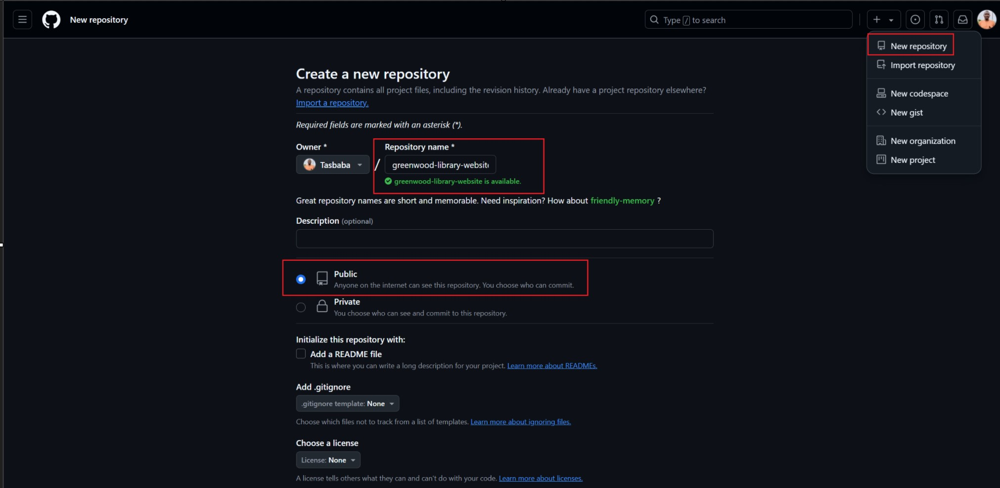

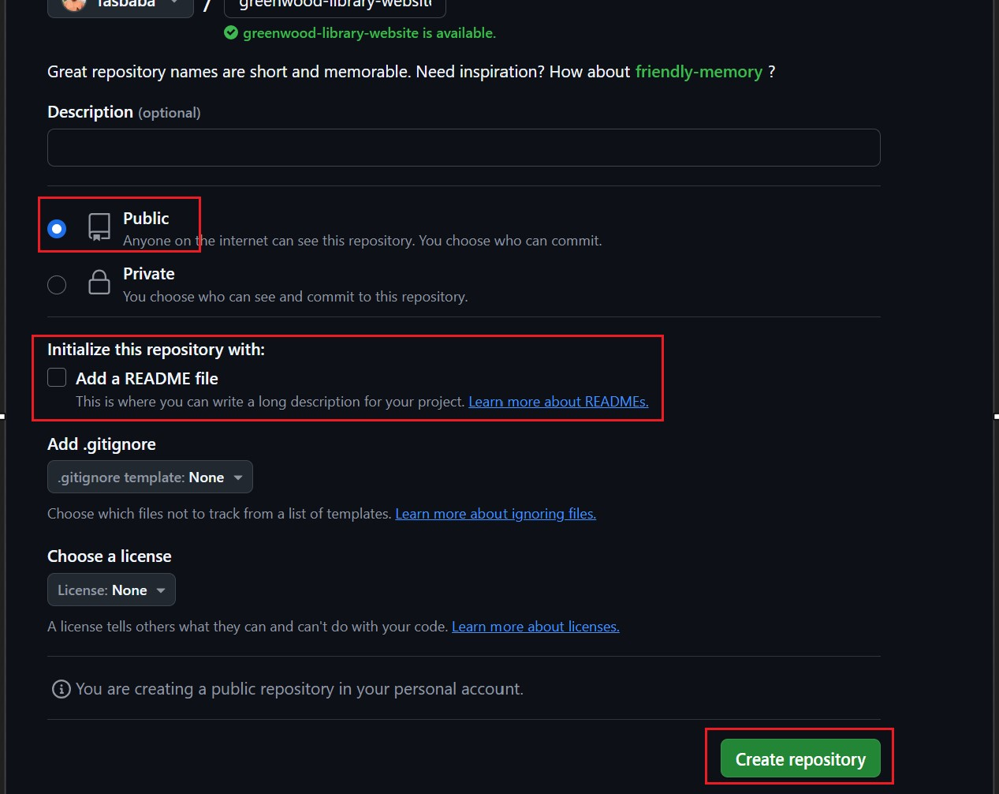

- The next step is to clone the created repository "greenwood-library-website" on Github on my local computer system by;

- I will click on code and then copy the HTTPS URL from my github as shown below while I use the command below on my Visual Studio Code Terminal to clone.

###### Copy HTTPS url from the github 
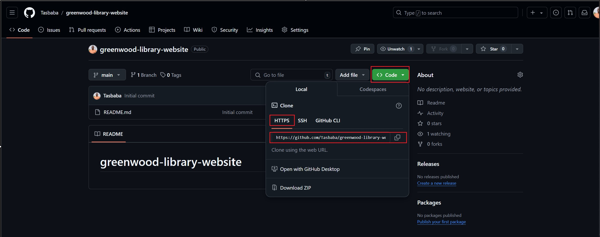

###### Used Command to clone via commandline terminal
- `git clone https://github.com/Tasbaba/greenwood-library-website.git`

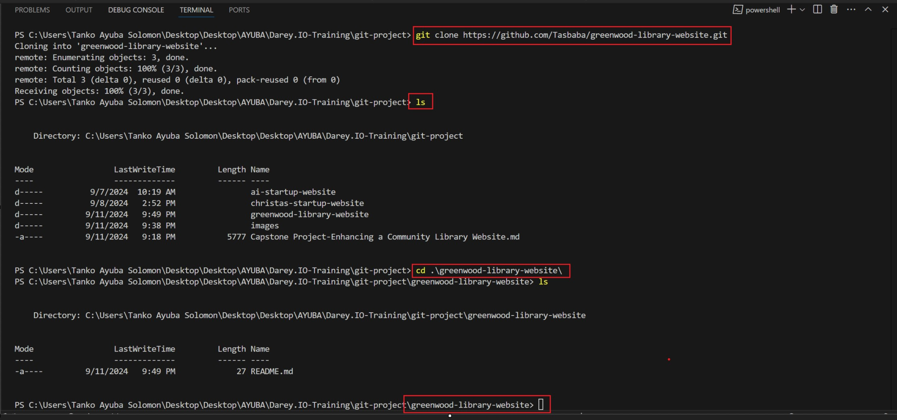

 #### Secondly, I used the Visual Studio editor to create "home, about_us, events, and contact_us html file for the each web pages, and I also added random content into each file on my main branch as shown below.

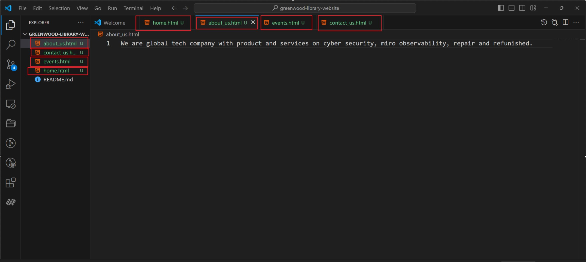

#### Thirdly, I have to Stage, commit and push the changes I made directly to my main branch of my teams existing codes for the website. And I use the below commands in sequence to achieve it.

#### Stage
- `git status`
- `git add .`

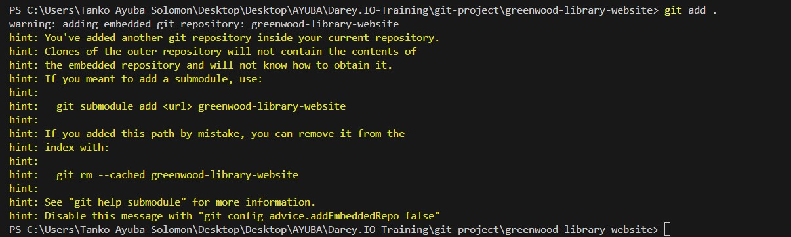
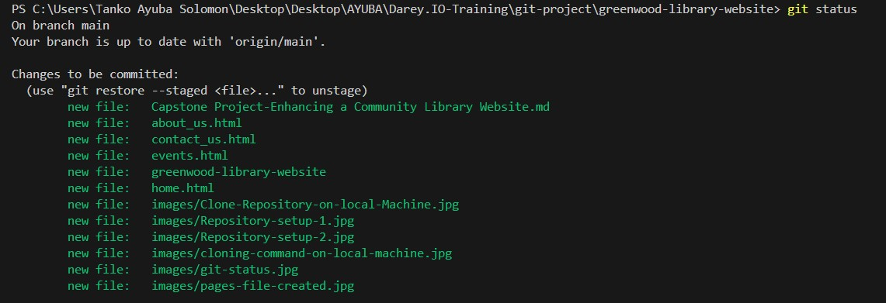

#### Commit
- `git status`
- `git commit -m "git commit actual website"`

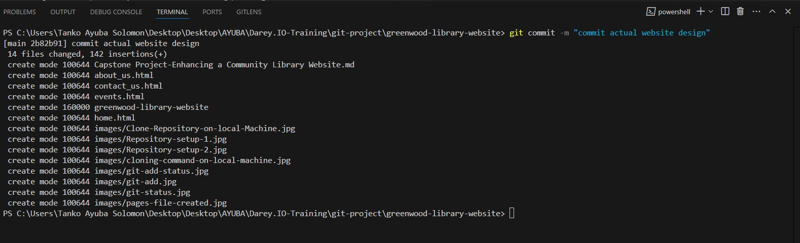
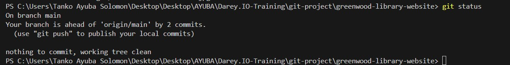

#### push
- `git status`
- `git push origin main`

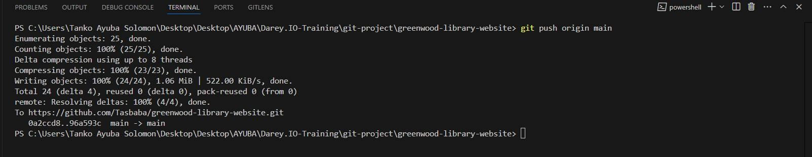
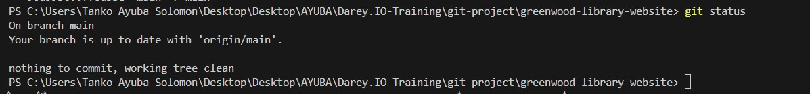

### Creating a branch for Morgan to "Add Book Reviews"

- In other for Morgan to execute his asigned task, I will create a branch and call the branch "add-book-reviews for him on the main branch, and add a new file called "book_reviews.html"
Morgan should add random text to the file.
- He should Stage, commit and push changes with a message "Add book review sections." and push the "add-book-review" branch to the Github.
- I then raise a PR for Morgan's work, and merge his work to the main branch.

#### Steps to achieve Morgans Task

- I create a branch for him and call it "add-book-reviews" using this command below.

- `git branch add-book-reviews`

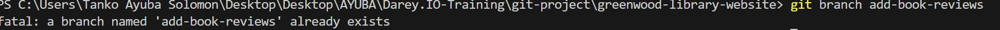

- I switch to the "add-book-reviews" branch using the below command, and created a "book_reviews.html file, and added content in it.

- `git checkout add-book-reviews`

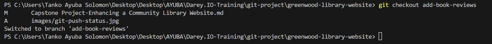

#### Stage
- `git status`
- `git add .`

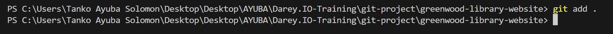

#### Commit
- `git status`
- `git commit -m "add book reviews section."`

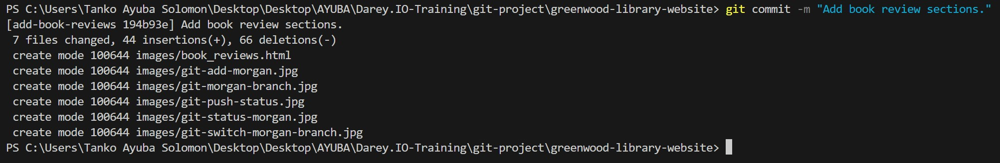

#### push
- `git status`
- `git push origin main`

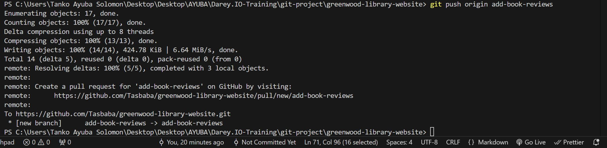

- I raise the PR by clicking the "compare and pull request" button from my Github, and I add book reviews section and then, click on the green button to create pull request.

- After check is completed and no error, I then merge the pull request, confirm merge, and delete branch.

### Creating a branch for Jamie's"update events page"

- In other for Jamie's to execute his asigned task, I will create a branch and call the branch "update-events" for him on the main branch, to enable him to add more content on "events.html".
- He should Stage, commit and push changes with a message "events of the year 2024." and push the "events" branch to the Github.
- I then raise a PR for Morgan's work, and merge his work to the main branch.

#### Steps to achieve Jamie'ss Task
- I will switch to the main, pull and then, create a branch for Jamie's to enable him add to the events, and I will call the "update-events" using this command below.

- `git branch update-events`

- I switch to the "add-book-reviews" branch using the below command, and created a "book_reviews.html file, and added content in it.

- `git checkout add-book-reviews`

#### Stage
- `git status`
- `git add .`

#### Commit
- `git status`
- `git commit -m "add book reviews section."`

#### push
- `git status`
- `git push origin main`

- I raise the PR by clicking the "compare and pull request" button from my Github, and I add book reviews section and then, click on the green button to create pull request.

- After check is completed and no error, I then merge the pull request, confirm merge, and delete branch.

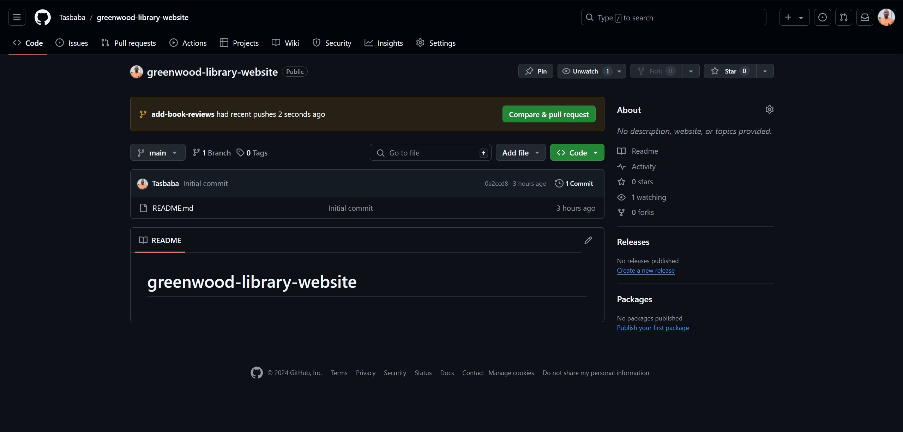
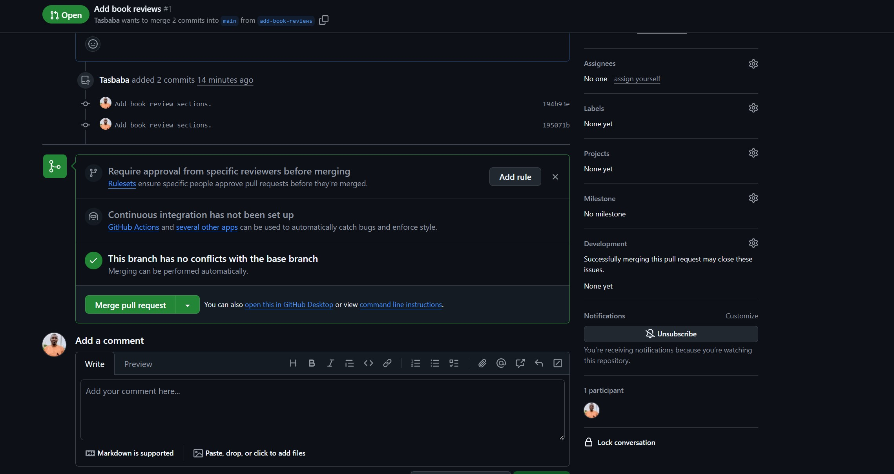

git
### Use the link below to preview project-1 implementation.
- [PROJECT 1: LAMP STACK IMPLEMENTATION](https://github.com/Tasbaba/Project-1/blob/main/project-1.md)